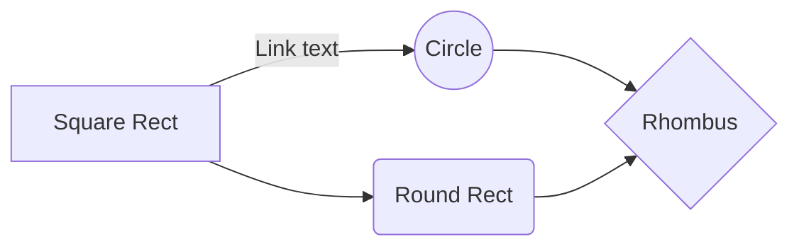

## Summary

[Concise summary of what this PR achieves.]

## Context

[The "why" behind this work—feature, bugfix, or chore reasoning.]

## Changes

Code Changes

- **`path/to/file.js`**
  - Detailed description of changes.
  

  

## Test Plan

- [ ] Initial verification (completed by developer).
- [ ] Manual verification step.
- [ ] Post-merge verification if necessary.

## Behavior Diagram

[This section should include a Mermaid diagram explaining this PR. Omit section if not relevant]

