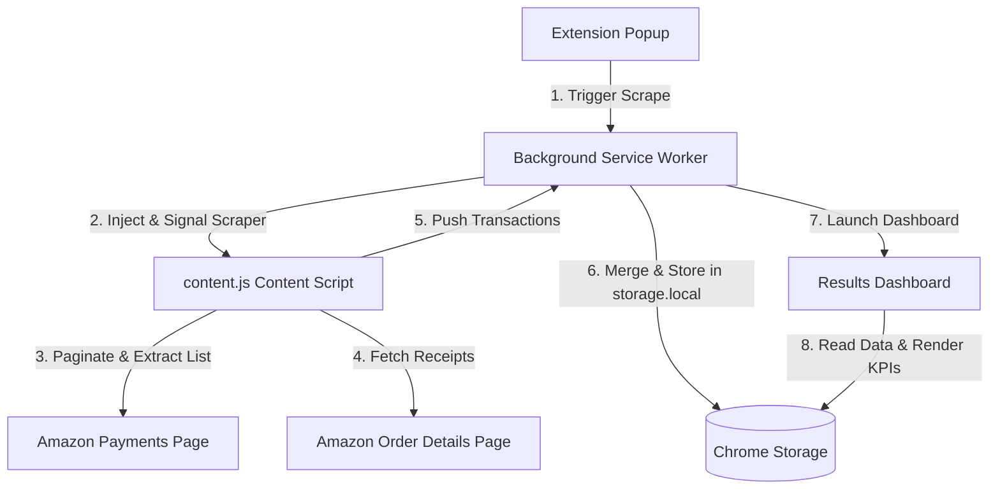

# DataPrime Extension - Architecture & Design Specifications

DataPrime is a high-performance, zero-dependency Manifest V3 Google Chrome extension designed to parse, aggregate, and visualize Amazon transaction histories. It seamlessly itemizes individual order lines (including standard physical items, digital subscriptions, and grocery receipts), deduplicates identical split-shipment charges, and renders comprehensive analytics in a glassmorphic dashboard interface.

---

## 📂 Codebase & Folder Layout

The project maintains a lean, dependency-free file structure that operates purely on native Web and Browser APIs:

```
dataprime/
├── manifest.json          # Manifest V3 configuration (permissions, worker, and resources)
├── content.js             # Content script: Scrapes payments DOM, handles receipt fetching
├── background.js          # Service worker: Orchestrates state, broadcasts data, seeds mock logs
├── popup/
│   ├── popup.html         # Custom popup setup and UI triggers
│   ├── popup.css          # Premium glassmorphic interface rules
│   └── popup.js           # Handles configuration presets, seeding, and triggers
├── dashboard/
│   ├── results.html       # Analytics dashboard UI
│   ├── results.css        # Premium dark-mode analytics visual style
│   └── results.js         # Coordinates dashboard charts, data exports, and KPI stats
├── tests/
│   └── parser.test.js     # Native Bun unit test suite (21 distinct test blocks)
└── Taskfile.yaml          # Orchestration tasks (formatting, checking, and packaging)
```

---

## 🧩 Component Specifications & Architectural Roles



### 1. Sc scraper Engine (`content.js`)

Runs inside the context of Amazon Payments pages. Its primary jobs are:

- **Transaction Extraction**: Parses dates, absolute prices, order links, card brands, and payment numbers from elements.
- **Occurrence-Suffixed Stable IDs**: Assigns a stable base key (`${orderId}-${dateISO}-${amount}`) to every transaction. For identical split charges (same order, day, and amount), it increments a stateful index suffix (`-0`, `-1`, `-2`) to cleanly register multiple purchases.
- **Dynamic Grocery Receipt Routing**: Detects grocery transactions (Fresh/Whole Foods/Prime Now) and dynamically rewrites transaction detail links to point to the receipt-friendly Ultra Fast Fresh (UFF) invoice endpoint (`page=itemmod`).
- **Resilient Regex Fallback Parser**: If standard DOM structures fail, it runs a regexp parser that slices the document into isolated ASIN context windows (separated by padded spacing) to extract prices, quantities, image URLs, and seller names.
- **Promotional & Advertisement Filtering**: Screens out co-branded credit card promotions (e.g. "Amazon Secured Card") and Prime Video recommendation links by discarding zero-priced items containing promotional keywords.
- **Dual-Layered Pagination Loop Protection**:
  1. **Disabled Element Filters**: Prevents clicking paginator buttons that are disabled via standard Chrome extension wrappers or Amazon `.a-disabled` classes.
  2. **Page-Hash Match**: Records the first transaction card IDs of the previous page. If navigating leads to the exact same list of transactions, it terminates pagination immediately.

### 2. State & Message Coordinator (`background.js`)

Acts as a central service worker orchestrating the extension state:

- **Scraping Lifecycle Coordination**: Manages status phases (`IDLE`, `RUNNING`, `ITEMIZING`, `COMPLETED`, `ERROR`) and broadcasts progress metrics.
- **Service Worker Lifecycle & State Recovery**: Persists and restores active scraping parameters and session states in `chrome.storage.local` to survive background worker termination by Chrome during periods of inactivity.
- **Store & Merge Pipe**: Merges newly scraped transaction lists with previous records inside `chrome.storage.local`, sorting the final table chronologically in descending order.
- **Mock Seeding**: Seeds high-fidelity spending logs (Electronics, Apparel, Groceries, Streaming, and Kitchen goods with multiple items and random pricing) for instant visual analytics verification.

### 3. Analytics Dashboard (`dashboard/`)

Provides a rich, interactive glassmorphic UI displaying purchase intelligence:

- **KPI Metrics Engines**: Calculates net spending, total item volumes, median/average order values, and highlights refund ratios.
- **Flexible Filters**: Features global search (which scans titles, order IDs, payment methods, and individual itemized products), date boundaries, price ranges, and category filters.
- **Blob Object URL Exporters**: Downloads CSV and JSON documents using transient Blob Object URLs to prevent browser-based file truncation at hash (`#`) characters.
- **Manual Operations**: Enables exporting clean files in CSV and JSON formats, database clearing, and demo seeding.

### 4. Zero-Dependency Testing Engine (`tests/parser.test.js`)

Executes **21 distinct unit tests** natively under Bun's test runner (`bun test`) in ~35ms:

- **Browser API Mocks**: Emulates `globalThis.window` and `globalThis.chrome` in Bun's runtime, letting tests run directly against production scripts.
- **Code Harmonization**: Integrates via a hybrid export hook at the bottom of `content.js`, ensuring zero duplication of production code.

---

## ⚡ Developer Workflow Integration

All development commands are governed by `Taskfile.yaml` to ensure cross-environment consistency:

| Command      | Action                                                                                             |
| ------------ | -------------------------------------------------------------------------------------------------- |
| `task lint`  | Validates `manifest.json` formatting, checks file integrity, runs Prettier check, and runs ESLint. |
| `task fix`   | Automatically formats project files using Prettier and runs ESLint auto-fixes.                     |
| `task test`  | Runs the zero-dependency Bun unit tests with native code coverage.                                 |
| `task check` | Pipeline check running linting validation followed by the unit tests.                              |
| `task build` | Packaging script assembling assets and compiling them into `dataprime-extension.zip`.              |

---

## 🔖 Commit Conventions & Automated Releases

DataPrime strictly adheres to the **Gitmoji** specification for commit messages to ensure structured, readable history and drive automated semantic releases.

### 1. Commit Message Format

Every commit message must begin with a valid Gitmoji character (e.g., `✨`, `🐛`) or shortcode (e.g., `:sparkles:`, `:bug:`):

```
<intention> [scope?][:?] <message>
```

**Examples:**

- `✨ (content): Scrape Fresh grocery invoices`
- `🐛 (dashboard): Correct monthly spending SVG bar heights`
- `🔖 (release): bump version to 1.1.0`

### 2. Linting Enforcement

Commit messages are validated locally prior to committing using the off-the-shelf `commitlint` pre-commit hook extending `commitlint-config-gitmoji`.
To activate the commit message linter hook:

```bash
pre-commit install --hook-type commit-msg
```

### 3. Automated Release Pipeline

When changes are pushed to `main`, the GitHub Actions release workflow:

1. Runs `semantic-release` utilizing the `semantic-release-gitmoji` plugin.
2. Determines the next version bump (`major`, `minor`, or `patch`) based on Gitmoji rules:
   - `:boom:` (💥) & `🎉` $\rightarrow$ **Major**
   - `:sparkles:` (✨) $\rightarrow$ **Minor**
   - `:bug:` (🐛), `:ambulance:` (🚑), `:lock:` (🔒), `:recycle:` (♻️) $\rightarrow$ **Patch**
3. Runs `scripts/update-manifest-version.js` to synchronize `manifest.json`'s version.
4. Packages the extension (`dataprime-extension.zip`).
5. Commits `manifest.json` version bumps back to `main` with `[skip ci]`.
6. Publishes a GitHub Release with the zipped package attached as an asset.
